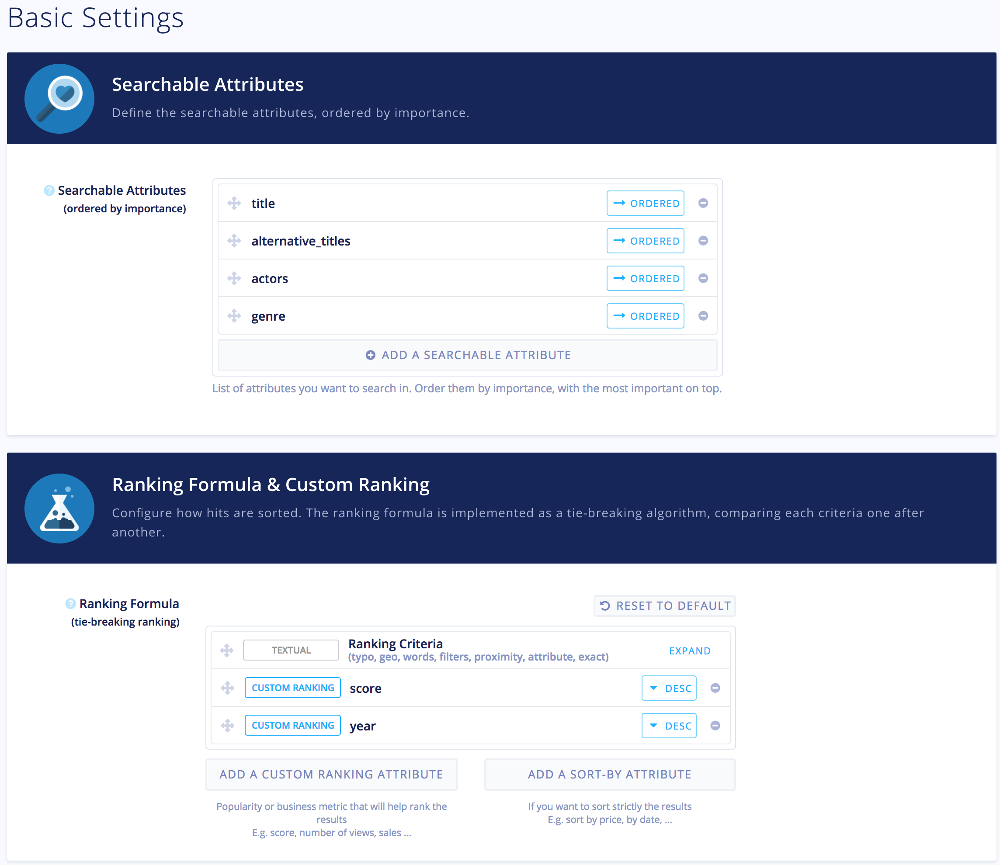
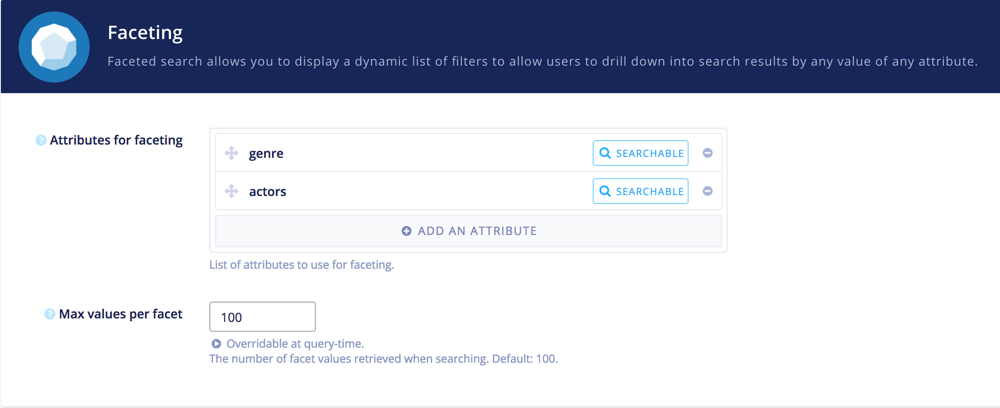
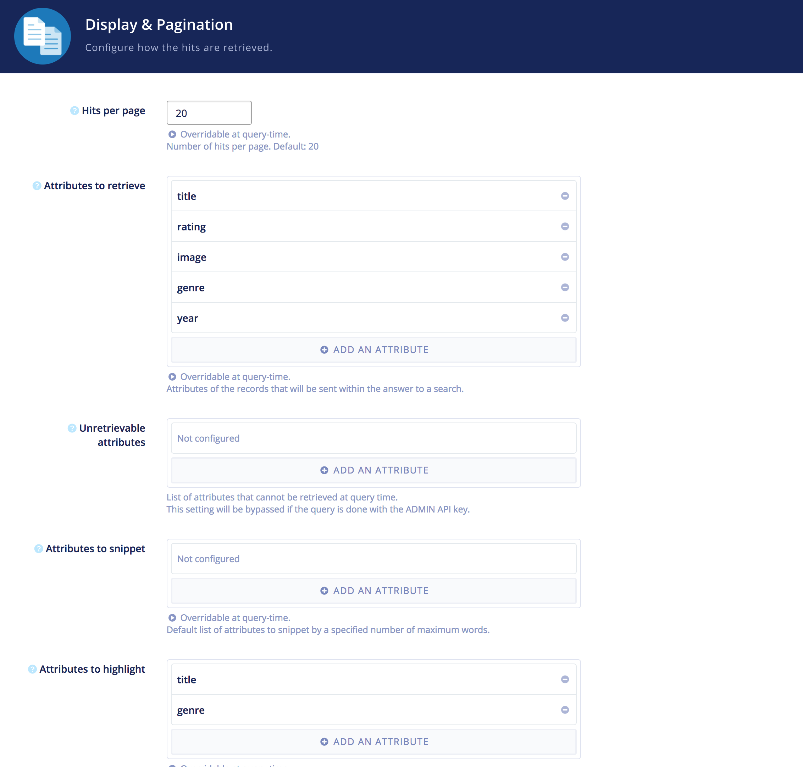

# Full-Stack Technical Test

The goal of this test is to evaluate your ability to architecture a small full-stack app.

You can see a running version of my code at [http://algolia.limbocitizen.com](http://algolia.limbocitizen.com)

## Getting started

### Downloading the project
```sh
git clone https://github.com/kombucha/algolia-challenge
cd algolia-challenge
yarn install
```

### Setting up the database
This app uses mongodb. You can spin an instance of mongo with docker. Just run : 
```
docker run -p 27017:27017 --name algolia-mongo -d mongo
```

### Setting up algolia

The index name used in this app is `movies`.
Here are screenshots of my config





I tried to reduce the payload size when searching by : 
  - Setting a minimum default attributes to retrieve (ie exclude unused attributes like color, actors etc)
  - Setting highlite only on title and genre (only attributes displayed)


### Setting up the env files
You then need to generate two env files, one for the client and one for the server
```
cp packages/algolia-movies-server/.env.template packages/algolia-movies-server/.env

cp packages/algolia-movies-client/.env.template packages/algolia-movies-client/.env
```

Fill out the relevant information in those env files: 

Server

| Variable          | Usage                                      | Default                        |
|-------------------|--------------------------------------------|--------------------------------|
| PORT              | The port to run the server on              | 9000                           |
| ALGOLIA_APP_ID    | The algolia app id                         |                                |
| ALGOLIA_ADMIN_KEY | The algolia admin key                      |                                |
| PUBLIC_PATH       | The path to the static build of the client | ../algolia-movies-client/build |
| UPLOADS_PATH      | Where to upload images (folder)            |                                |
| DB_URI            | The mongodb uri                            |                                |


Client

| Variable                     | Usage                               | Default | 
|------------------------------|-------------------------------------|---------| 
| REACT_APP_ALGOLIA_APP_ID     | The algolia app id (same as server) |         | 
| REACT_APP_ALGOLIA_SEARCH_KEY | The algolia search only key         |         | 


### Starting the app

Finally 😅, you can start the app in dev mode : 
```sh
yarn run start
```

### (Optional)
You can seed the database
```sh
cd packages/algolia-movies-server
yarn run import-movies
```


## Instructions

The app is comprised of 2 parts:

- the backend, responsible for:
  - handling the HTTP routing;
  - storing items in a database;
  - indexing items in an Algolia index when they change;

- and the JS frontend, responsible for displaying two pages:
  - one displaying a search page;
  - one displaying a form to add records to the index.

The app you need to build is a small **Movies DB admin page**. The initial import dataset can be found here: [movies.json](https://gist.github.com/alexandremeunier/49533eebe2ec93b14d32b2333272f9f8).

### Backend

Build a minimal application using technologies you are most confortable with (e.g. Rails, Node). Should you use Rails, you can use the [algoliasearch-rails](https://github.com/algolia/algoliasearch-rails) integration.

The app needs to implement the following endpoints:

  - `GET /` => Render an HTML page displaying the JS frontend app;
  - `POST /api/1/movies` => Add a movie (as a JSON object) to the DB and return its `id`;
  - `DELETE /api/1/movies/:id` => Delete a amovie from the DB.

The items should be indexed in Algolia.

### Frontend

Build a minimal React SPA that can be used to search for, delete, and add new movies along with the [Algolia JS client](https://github.com/algolia/algoliasearch-client-js). Remember, you might not need Redux :).

- the search page needs to:
  - display a searchbox to search in the movies using Algolia;
  - show the results as a list or table;
  - it should be possible to delete any item in the results using the Backend API;

- the form page needs to:
  - display a form to create a new item;
  - validates that the data has the correct format;
  - use the Backend API to add the item to the DB and Algolia.

## Evaluation Criteria

Please push your code to a public GitHub repository. We'll assess the following in priority:

- the quality of the code;
- the UI & UX of the frontend app;
- the architecture of the backend app.


Good luck!
